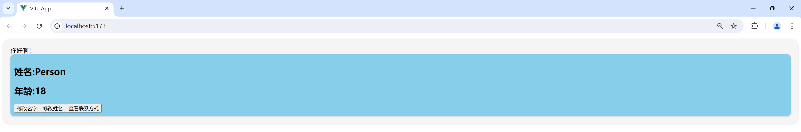
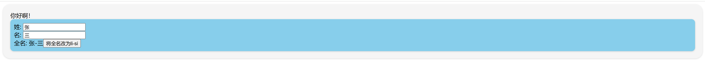
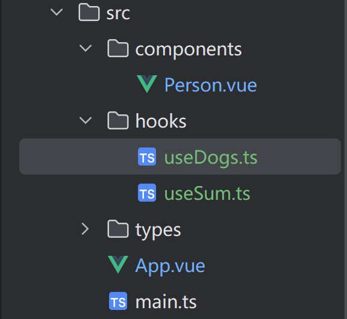
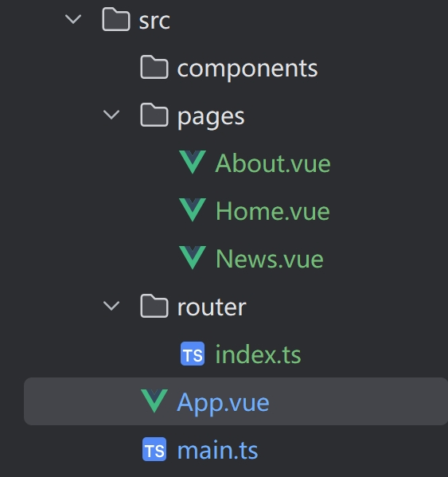
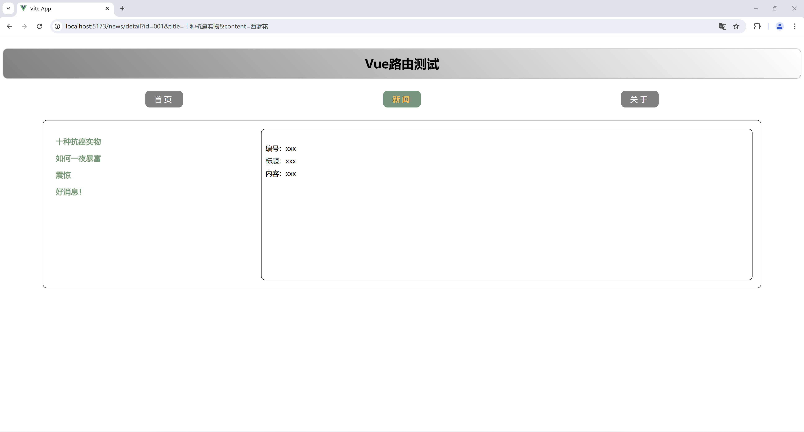
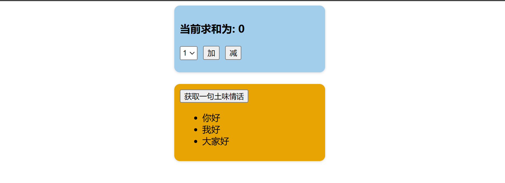

# Vue3学习笔记

## 第一天

### 基于vite创建Vue3项目


 项目虽然使用TypeScript，但是任然可以使用JavaScript

 Vue Router（路由）和ESLint等选项根据自身需求选择

 下载项目对应的module文件

 默认运行项目指令`npm run dev`或`yarn dev`(前提是安装yarn包)

### src文件夹介绍

 src文件夹默认包含`main.ts`,`App.vue`和`components`三部分，其中main.ts包括以下代码

```typescript
// 引入createApp用于创建应用
import {createApp} from "vue";
// 引入app组件
import App from "./App.vue";

createApp(App).mount("#app");
```

 `App.vue`是根组件，主要包括以下代码

```vue
<template>
    !-- html结构 -->
</template>

<script lang = "ts">
	// TS或JS
</script>

<style>
	// CSS样式，可写SASS和LESS
</style>
```

 `components`是存放枝组件的文件夹

### 实现一个简单的效果

```vue
// person.vue
<script lang="ts">
export default {
    name: 'Person',
    data(){
        return {
            name: "Person",
  			age: 18,
  			tel: '13812345678'
        }
    },
    methods: {
        changeName() {
            this.name = 'zhangsan'
        },
        changeAge() {
    		this.age++
		},
    	showTel() {
            alert(this.tel)
        }
    }
  
}
</script>

<template>
  <div class="person">
    <h2>姓名:{{ name }}</h2>
    <h2>年龄:{{ age }}</h2>
    <button @click="changeName">修改名字</button>
    <button @click="changeAge">修改姓名</button>
    <button @click="showTel">查看联系方式</button>
  </div>
</template>

<style scoped>
.person {
  background-color: skyblue;
  border-radius: 10px;
  padding: 10px;
  box-shadow: 0px 1px 4px rgba(0, 0, 0, 0.15);
}
</style>
```

 调用person组件

```vue
<script lang="ts">
import Person from "./components/person.vue" // 引入person.vue

export default {
  name: 'App', // 组件名
  components: {
    Person
  }
}
</script>

<template>
  <div class="app">你好啊！
    <Person></Person>
  </div>

</template>

<style scoped>
.app {
  background-color: #f5f5f5;
  box-shadow: 0px 1px 4px rgba(0, 0, 0, 0.15);
  border-radius: 20px;
  padding: 20px;
}
</style>
```

 呈现效果



### OptionsAPI与CompositionAPI

 Vue2是标准的选项式API，将数据（data），方法（methods），计算（computed），观察（watch）等分开写；优点在于，组件逻辑清晰，在组件功能较少时区分明显；缺点在于，当组件数据、功能较多时想新增过修改需求，需要分别修改data,methods,computed等，不便于维护和复用。可以说，写Vue2，就是学会写配置项。

 Vue3是组合式API，优点在于可以用函数的方式，更加优雅的组织代码，让相关功能的代码更加有序的组织在一起。也是Vue官方首推使用的方式。

### 拉开序幕的setup

 setup是Vue3新增的配置项，值是一个函数，组件中所有的数据、方法、计算属性等都配置在setup中

 其特点如下

- `setup`函数返回的对象中的内容可直接在模版中使用
- `setup`中访问的`this`是`undefined`，也就是不能在`setup`中使用this指代数据
- `setup`函数会在`beforeCreate`之前使用，它是“领先”所有钩子执行的

```vue
<script lang="ts">
export default {
  name: "Person",
  setup() {
    console.log(this) // setup中的this是undefined
    // 数据：原来是写在data中的
    // 这样写不是响应式数据
    let name = '张三'
    let age = 18;
    let tel = '13812345678'

    // 方法
    function changeName() {
      name = 'zhangsan' // 注意：这样修改name，页面是没有变化的
        				// name确实修改了，但页面上的name不会更改
        				// this.name这种写法是错误的
    }

    function changeAge() {
      age++
    }

    function showTel() {
      alert(tel)
    }

    return {name, age, tel, changeName, changeAge, showTel} // 可以使用键值对，如{a : name, 	b : age}；也可以直接写变量名和函数名
  },
}
</script>

<template>
  <div class="person">
    <h2>姓名:{{ name }}</h2>
    <h2>年龄:{{ age }}</h2>
    <button @click="changeName">修改名字</button>
    <button @click="changeAge">修改年龄</button>
    <button @click="showTel">查看联系方式</button>
  </div>
</template>

<style scoped>
.person {
  background-color: skyblue;
  border-radius: 10px;
  padding: 10px;
  box-shadow: 0px 1px 4px rgba(0, 0, 0, 0.15);
}

button {
  margin: 0 5px;
}
</style>

```

 此时，我们顺利使用Vue3重构本项目，但是你可以发现，名字和年龄并没有修改，而查看联系方式这个函数能正常执行

### `setup`与`optionAPI`

 在这个组件中，我同时使用了Vue2和Vue3的语法，由于`setup`的生命周期先于beforeCreate，此时setup中的数据成为了全局变量，所以在`data`中依然能访问到`setup`里面的数据。不过我们不推荐在一个项目中Vue2和Vue3的语法混写，这不利于项目的维护

```vue
<script lang="ts">
export default {
  name: "Person",
  data() {
    return {
      a: '测试'
    }
  },
  methods: {
    b() {
      console.log(this.a)
    }
  },
  setup() {
    console.log(this) // setup中的this是undefined
    // 数据：原来是写在data中的
    // 这样写不是响应式数据
    let name = '张三'
    let age = 18
    let tel = '13812345678'

    // 方法
    function changeName() {
      name = 'zhangsan' // 注意：这样修改name，页面是没有变化的
    }

    function changeAge() {
      age++
    }

    function showTel() {
      alert(tel)
    }

    return {name, age, tel, changeName, changeAge, showTel}
  },
}
</script>

<template>
  <div class="person">
    <h2>姓名:{{ name }}</h2>
    <h2>年龄:{{ age }}</h2>
    <button @click="changeName">修改名字</button>
    <button @click="changeAge">修改姓名</button>
    <button @click="showTel">查看联系方式</button>
    <hr>
    <h2>测试：{{ a }}</h2>
    <button @click="b">查看</button>
  </div>
</template>

<style scoped>
.person {
  background-color: skyblue;
  border-radius: 10px;
  padding: 10px;
  box-shadow: 0px 1px 4px rgba(0, 0, 0, 0.15);
}
</style>
```


## 第二天

### `setup`语法糖

 在之前的代码中，我们在`export default`里面单独写了`setup`配置项，其实我们可以把`setup`独立出去

 下面的代码中我单独写了两个script，一个专门用于写组件的名字，另一个专门用于写组合式API

 并且在单独的setup标签中，我们不需要写return返回值

```vue
// 这个标签的lang="ts"不能少
<script lang="ts">
export default {
  name: "Person",
}
</script>

<script lang="ts" setup>
// console.log(this) // setup中的this是undefined
// 数据：原来是写在data中的
// 这样写不是响应式数据
let name = '张三'
let age = 18
let tel = '13812345678'

// 方法
function changeName() {
  name = 'zhang_san' // 注意：这样修改name，页面是没有变化的
}

function changeAge() {
  age++
}

function showTel() {
  alert(tel)
}
</script>
```

### `ref`创建基本类型的响应式数据

 对基础数据类型要实现相应式，只需用`ref()`包裹数据

 注意：`JS`中操作数据需要`xxx.value`，但在模版中不需要`.value`

 对于`let name = '张三'`,`name`不是响应式的，`name.value`是

```vue
<script lang="ts" setup name="Person">
import {ref} from "vue";	// 引入ref
    
// 数据
let name = ref('张三')	// 此时name已经成为响应式数据
let age = ref(18)
let tel = '138111111111'

// 方法
function changeName() {	// 要访问到真正的name，需要使用name.value
    name.value = 'zhang_san'
}
    
function changeAge() {
    age.value ++
}
</script>
```

### `reactive`创建_对象类型的响应式数据

 `reactive`只能作用于对象，并且在`js`中操作数据不需要`.value`

```vue
<script lang="ts" setup name="Person">
import {reactive} from "vue";

// 数据
let car = reactive({brand: '奔驰', price: 100})	// 使用reactive包裹对象的数据，从而变成响应式数据
let games = reactive([	// 也可以包裹数组对象
  {id: 'wzry', name: '王者荣耀'},
  {id: 'ys', name: '原神'},
  {id: 'xqtd', name: '星穹铁道'}
])

let obj = reactive({
  a: {
    b: {
      c: 666
    }
  }
})

// 方法
const changePrice = () => {
  car.price += 10
}

const changeFirstName = () => {
  games[0].name = '绝区零'
}

const changeObj = () => {
  obj.a.b.c = 999
}
</script>
```

### `ref`创建_对象类型的响应式数据

```vue
 ref -> 可以定义：基本类型、对象类型的响应式数据

 reactive -> 只能定义：对象类型的响应式数据
```

 使用`ref`包裹对象本质上是他的`.value`变成`Proxy`,其实底层是用`reactive`实现的

```vue
<script lang="ts" setup name="Person">
import {ref} from "vue";

let car = ref({brand: '奔驰', price: 100})
let games = ref([
  {id: 'wzry', name: '王者荣耀'},
  {id: 'ys', name: '原神'},
  {id: 'xqtd', name: '星穹铁道'}
])

let obj = ref({
  a: {
    b: {
      c: 666
    }
  }
})

const changePrice = () => {
  car.value.price += 10	// 注意.value的位置，是操作car.value的数据
}

const changeFirstName = () => {
  games.value[0].name = '绝区零'
}

</script>
```

### `ref`对比`reactive`

 宏观角度

- 1.`ref`用来定义：基本数据类型，对象数据类型
- 2.`reactive`用来定义：对象类型数据

 区别

- 1.`ref`创建的变量必须使用`.value`（可以使用`volar`插件自动添加`.value`）
- 2.`reactive`重新分配一个新对象，会**失去**响应式（可以使用`Object.assign`去整体替换）

 使用原则

- 1.若需要一个基本类型的响应式数据，必须使用`ref`
- 2.若需要一个响应式对象，层级不变，`ref`,`reactive`都可以
- 3.若需要一个响应式对象，且层级较深，推荐使用`reactive`

```vue
<script lang="ts" setup name="Person">
import {ref, reactive} from "vue";

let car = ref({brand: '奔驰', price: 100})
let sum = ref(0)

const changePrice = () => {
  car.value.price += 10
}

const changeSum = () => {
  sum.value += 10
}

const changeBrand = () => {
  car.value.brand = '奥迪'
}

const changeCar = () => {
  // car = {brand: '宝马', price: 100}	// 这样的car就不再是响应式对象了
  // car = reactive({brand: '宝马', price: 200})	// reactive({brand: '宝马', price: 200})是新的对象了，不是原来的car对象
  // 下面这个写法页面可以更新
  // Object.assign(car, {brand: '宝马', price: 200})
  car.value = {brand: '宝马', price: 200}
}

</script>
```

### `toRef`和`toRefs`

 使用解构的时候，例如`let {name, age} = person`，此时`name`和`age`不是响应式数据，即使`let person = reactive({name: '张三', age: 18})`，这就相当于`let name = person.name`,修改的是`name`,而不是`person.name`,可以使用`toRefs`将对象变成多个`ref`定义的响应式对象

 注意使用`toRefs`定义的对象需要使用`.value`获取数据

 `let nl = toRef(person, 'age')`是解构单个对象变成响应式数据，`let 变量 = toRef(对象, 'key')`

```vue
<script lang="ts" setup name="Person">
import {reactive, toRefs, toRef} from 'vue';

let person = reactive({
  name: '张三',
  age: 18
})

let {name, age} = toRefs(person)
let nl = toRef(person, 'age')
console.log(nl.value)
// console.log(name)
// console.log(age)

function changeName(){
  name.value += '~'
}

function changeAge(){
  age.value += 1
}

</script>
```

## 第三天

### `computed`计算属性

在很多时候，我们需要使用已知的数据去获取新的数据，虽然可以直接在模版上面进行计算，但是这样不利于后期的维护，也会使模版变得更加臃肿，因此我们引入`computed`的概念，将所有需要计算的值统一放在里面

```vue
<template>
  <div class="person">
    姓: <input type="text" v-model="firstName"/>
    <br>
    名: <input type="text" v-model="lastName"/>
    <br>
    全名: <span>{{ fullName }}</span>
    <button @click="changeFullName">将全名改为li-si</button>
  </div>
</template>
```

这个案例的作用是分别输入姓和名，在最下方的全名标签会计算出名称



我们使用`fullName`变量去接收`computed`计算出来的数值

```vue
<script lang="ts" setup name="Person">
import {ref, computed} from 'vue';

let firstName = ref('张')
let lastName = ref('三')

// 这样定义fullName是一个计算属性，可读可写
let fullName = computed({
  // 计算后传递出去的值
  get() {
    return firstName.value.slice(0, 1).toUpperCase() + firstName.value.slice(1) + "-" + lastName.value
  },
  // val是计算出来的数值
  set(val) {
    const [str1, str2] = val.split('-')
    firstName.value = str1
    lastName.value = str2
  }
})
```

### `watch`监视

作用：监视数据的变化

特点：Vue3中的`watch`只能监视以下四种情况

- 1.`ref`定义的数据
- 2.`reactive`定义的数据
- 3.函数返回一个值
- 4.一个包含上述内容的数组

使用方法

- 1.引入`watch`,`import {watch} from 'vue'`
- 2.格式`watch(监视的基本类型数据, (newValue, oldValue), {deep、immediate、可选})

#### 监视`ref`定义的基本类型数据

`newValue` 是更新后的数据,`oldValue`是更新前的数据

```vue
<script lang="ts" setup name="Person">
import {ref, watch} from 'vue';

let sum = ref(0)

function changeSum() {
  sum.value++
}

// 监视
 watch(sum, (newValue, oldValue) => {
  console.log('sum变化了', newValue, oldValue)
  if(newValue >=10) {
    stopWatch()
  }
})

</script>

<template>
  <div class="person">
    <h1>监视ref定义的基本类型数据</h1>
    <h2>当前求和为：{{ sum }}</h2>
    <button @click="changeSum">点我加1</button>
  </div>
</template>
```

#### 监视`ref`定义的对象类型数据

```vue
<script lang="ts" setup name="Person">
import {ref, watch} from 'vue';

let person = ref({
  name: '张三',
  age: 18
})

function changeName() {
  person.value.name = 'zhang-san'
}

function changeAge() {
  person.value.age++
}

function changePerson() {
  person.value = {
    name: '李四',
    age: 100
  }
}

// 监视的是对象的地址值，若想监视对象内部属性的变化，需要手动深度监视
watch(person, (newValue, oldValue) => {
  console.log(newValue, oldValue)
}, {deep: true})

/*
watch的第一个参数是：被监视的数据
watch的第二个参数是：监视的回调
watch的第三个参数是：配置对象（deep, immediate等等……） 
*/

</script>

<template>
  <div class="person">
    <h1>监视ref定义的对象类型数据</h1>
    <h2>姓名:{{ person.name }}</h2>
    <h2>年龄:{{ person.age }}</h2>
    <button @click="changeName">修改名字</button>
    <button @click="changeAge">修改年龄</button>
    <button @click="changePerson">修改整个人</button>
  </div>
</template>
```

如果你细心可以发现，点击修改姓名和年龄按钮时，`newValue`和`oldValue`的值是一样的，但是点击修改整个人，`newValue`和`oldValue`又不一样。这是因为修改姓名和年龄的操作是只修改它的值，却并没有它的地址（你可以类比于C++的指针），而我们`newValue`和`oldValue`其实是监视它地址的变化；反之修改整个人，其实是单独开辟新的地址，并将这块地址命名为person，person的地址发生改变，因此`newValue`和`oldValue`不一样

#### 监视`reactive`定义的对象类型数据

监视`reactive`相比于`ref`最大的区别是`reactive`会自动完成深度监视，并且不能取消

```vue
<script lang="ts" setup name="Person">
import {reactive, watch} from 'vue';

let person = reactive({
  name: '张三',
  age: 18
})

function changeName() {
  person.name = 'zhang-san'
}

function changeAge() {
  person.age++
}

function changePerson() {
  // person = {
  //   name: '李四',
  //   age: 100
  // }
  Object.assign(person, {
    name: '李四',
    age: 100
  })
}

let obj = reactive({
  a: {
    b: {
      c: 100
    }
  }
})

function test() {
  obj.a.b.c = 888
}

// 监视reactive定义的对象类型数据，且默认开启深度监视
watch(person, (newValue, oldValue) => {
  console.log(newValue, oldValue)
})

watch(obj, (newValue, oldValue) => {
  console.log(newValue, oldValue)
})

/*
watch的第一个参数是：被监视的数据
watch的第二个参数是：监视的回调
watch的第三个参数是：配置对象（deep, immediate等等……）
*/

</script>

<template>
  <div class="person">
    <h1>监视ref定义的对象类型数据</h1>
    <h2>姓名:{{ person.name }}</h2>
    <h2>年龄:{{ person.age }}</h2>
    <button @click="changeName">修改名字</button>
    <button @click="changeAge">修改年龄</button>
    <button @click="changePerson">修改整个人</button>
    <hr>
    <h2>测试:{{ obj.a.b.c }}</h2>
    <button @click="test">点我修改</button>
  </div>
</template>

```

这个例子你又可以发现，点击修改整个人，`newValue`和`oldValue`却是一样，原因在于这行代码

`Object.assign(person, {name: '李四', age: 100})`

`assign`操作是将新的对象直接赋值给原来旧的对象，并没有单独开辟新的地址，因此`newValue`和`oldValue`一样

#### 监视`ref`或`reactive`定义的对象类型数据中的某个属性

- 1.若该属性值不是**对象类型**，需写成函数形式
- 2.若该属性值依然是**对象类型**，可以直接写，也可以写成函数，推荐写成函数

```vue
<script lang="ts" setup name="Person">
import {ref, reactive, watch} from 'vue';

let person = reactive({
  name: '张三',
  age: 18,
  car: {
    c1: '奔驰',
    c2: '宝马'
  }
})

function changeName() {
  person.name += '~'
}

function changeAge() {
  person.age += 1
}

function changeFirstCar() {
  person.car.c1 = '奥迪'
}

function changeSecondCar() {
  person.car.c2 = '大众'
}

function changeCar() {
  person.car = {
    c1: '雅迪',
    c2: '艾玛'
  }
}

// 监视响应式对象中的某个属性，且该属性是基本类型时，要写成函数
watch(() => person.name, (newValue, oldValue) => {
  console.log(newValue, oldValue)
},)

watch(() => person.car, (newValue, oldValue) => {
  console.log(newValue, oldValue)
}, {deep: true})

</script>

<template>
  <div class="person">
    <h2>姓名:{{ person.name }}</h2>
    <h2>年龄:{{ person.age }}</h2>
    <h2>汽车:{{ person.car.c1 }}、 {{ person.car.c2 }}</h2>
    <button @click="changeName">修改姓名</button>
    <button @click="changeAge">修改年龄</button>
    <button @click="changeFirstCar">修改第一台车</button>
    <button @click="changeSecondCar">修改第二台车</button>
    <button @click="changeCar">修改整个车</button>
  </div>
</template>
```

结论：监视的要是对象里面的属性，那么最好写函数式，注意点：若是对象监视的是地址值，需要关注对象内部，需要手动开启深度监视

#### 监视上述多个数据

```vue
<script lang="ts" setup name="Person">
import {ref, reactive, watch} from 'vue';

let person = reactive({
  name: '张三',
  age: 18,
  car: {
    c1: '奔驰',
    c2: '宝马'
  }
})

function changeName() {
  person.name += '~'
}

function changeAge() {
  person.age += 1
}

function changeFirstCar() {
  person.car.c1 = '奥迪'
}

function changeSecondCar() {
  person.car.c2 = '大众'
}

function changeCar() {
  person.car = {
    c1: '雅迪',
    c2: '艾玛'
  }
}

// 数组包函数
watch([() => person.name, () => person.car.c1], (newValue, oldValue) => {
  console.log(newValue, oldValue)
})

</script>

<template>
  <div class="person">
    <h2>姓名:{{ person.name }}</h2>
    <h2>年龄:{{ person.age }}</h2>
    <h2>汽车:{{ person.car.c1 }}、 {{ person.car.c2 }}</h2>
    <button @click="changeName">修改姓名</button>
    <button @click="changeAge">修改年龄</button>
    <button @click="changeFirstCar">修改第一台车</button>
    <button @click="changeSecondCar">修改第二台车</button>
    <button @click="changeCar">修改整个车</button>
  </div>
</template>
```

#### 总结

- **基本类型的 `ref`**：`newValue` 和 `oldValue` 在值变化时不同。
- **对象类型的 `ref`**：修改对象属性不会改变引用，`newValue` 和 `oldValue` 相同；重新赋值对象时不同。
- **`reactive`**：修改对象属性不会改变引用，`newValue` 和 `oldValue` 相同；重新赋值对象时不同。值得说明的一点是在`reactive`的情况下对象赋值只能通过`assign`的方式，因此`newValue` 和 `oldValue`一定相同

## 第四天

### `watchEffect`

在很多时候我们需要同时监视多个数据，因此可以使用`watch`配合数组进行监视

在下面的代码中，我们定义了`tmp`和`height`两个变量，有两个函数可以更新他的值，如果`tmp >= 60`或`height >= 80`时会返回字符串

```ts
// 数据
let tmp = ref(10)
let height = ref(0)

// 方法
function changeSum() {
  tmp.value += 10
}

function changeHeight() {
  height.value += 10
}

// watch实现
watch([tmp, height], (value) => {
  // console.log(value)
  let [newTmp, newHeight] = value // 从value中获取最新的水温水位
  if (newTmp >= 60 || newHeight >= 80) {
    console.log('给服务器发请求')
  } else console.log(newTmp, newHeight)
})
```

但是如果此时我们无需监视`height`，我们需要分别将与`height`有关的代码全部删除，这不利于维护，因此我们可以使用`watchEffect`代替`watch`

`watchEffect`会监控需要监控的全部数据，无需程序员手动维护监控

```ts
// 监视 --watchEffect实现
watchEffect(()=>{
  if(tmp.value >= 60 || height.value >= 80) {
    console.log('给服务发送请求')
  }
})
```

### 标签`ref`

如果此时有多个组件，我们需要获取某一个组件里面的`div`标签，以往我们会使用`class`或`id`获取，但是在Vue中，如果多个组件都存在id相同的标签那么会将他们一并获取，这不利于我们准确获取标签

例如我们要获取`h2`标签，只需为他添加`ref`

```html
<h2 ref="beijing">北京</h2>
```
并且设置变量接收

```ts
let beijing = ref()
```

使用`.value`就可以精确获取标签

```ts
console.log(beijing.value)
```

### TS中的接口、泛型、自定义类型

此时有一个对象`person`，里面包含一些数据,假如此时我的`name`写错了，或者`id`传入了`number`，编译器是不会有报错提示的（个别）

```ts
let person = {
    id: '12321',
    name: '张三',
    age: 60
  }
```

为了进一步规范和约束数据，我们在src文件夹中新建types文件夹，并且创建一个`index.ts`文件，专门用于编写接口文件

```ts
// 定义一个接口用于限制person对象的具体属性
export interface PersonInter {
    id: string,
    name: string,
    age: number
}
```

使用时需要先引入文件

```ts
import {type PersonInter} from '@/types'

let person : PersonInter = {
    id: '12321',
    name: '张三',
    age: 60
}

```

但是如果我们是数组包对象

```ts
// 第一种写法
let person : Array<PersonInter> =[
  {
    id: '12321',
    name: '张三',
    age: 60
  },
  {
    id: '12321',
    name: '张三',
    age: 60
  }
]

// 第二种写法
let person : PersonInter[] = [
  {
    id: '12321',
    name: '张三',
    age: 60
  },
  {
    id: '12321',
    name: '张三',
    age: 60
  }
]

// 第三种写法
let person = <PersonInter[]> [
  {
    id: '12321',
    name: '张三',
    age: 60
  },
  {
    id: '12321',
    name: '张三',
    age: 60
  }
]

// 第四种写法
let person = <Array<PersonInter>> [
  {
    id: '12321',
    name: '张三',
    age: 60
  },
  {
    id: '12321',
    name: '张三',
    age: 60
  }
]
```

当然我们也可以定义数组包对象的接口

```ts
// 第一种
export type PersonList = Array<PersonInter>
// 第二种
export type PersonList = PersonInter[]
```

使用方法

```ts
import {type PersonList} from '@/types'

let person = <PersonList> reactive([
  {
    id: '12321',
    name: '张三',
    age: 60
  },
  {
    id: '12321',
    name: '张三',
    age: 60
  }
])
```

### `props`的使用

很多时候我们需要进行组件间的数据沟通，比如父组件的数据给子组件

`a = "哈哈"`是将字符串传递给`Person`组件，`:list = "personList"`是将数组传递给子组件；注意，`:list`其实是`v-bind-list`的简写,主要用于传递表达式，而`list`是传递数据的名字

```vue
<script lang="ts" setup name=App>
import Person from "./components/Person.vue";
import {type PersonList} from "./types";
import {reactive} from "vue";

let personList = reactive<PersonList>([
  {
    id: '0',
    name: '张三',
    age: 18
  },
  {
    id: '1',
    name: '李四',
    age: 20
  }]
)

</script>

<template>
  <div class="app">
    <Person a="哈哈" :list = "personList"></Person>
  </div>

</template>
```

子组件接收

```ts
// 只接收
defineProps(['a', 'list'])
```

在模版中可以正常使用

```vue
<template>
  <div class="person">
    <ul>
      <li v-for="person in list" :key="person.id">
        姓名:{{ person.name }}
        年龄:{{ person.age }}
      </li>
    </ul>
  </div>
</template>
```

但是如果只看模版，你无法知道`list`是自定义的数据还是父组件传递的数据

```ts
// 接收a,同时将props保存起来
let x = defineProps(['a', 'list'])
```

我们也可以限制传入的数据类型，防止父组件失误将错误的数据传给我们

```ts
// 接收list+限制类型
defineProps<{ list: PersonList }>()
```

但是如果父组件传递错误数据，模版根本不会渲染，会导致相应部分空白，这也是不好的，因此我们可以自定义默认数据

注意：指定的`list`应为函数对象

```ts
// 接收list+限制类型+限制必要性+指定默认值
withDefaults(defineProps<{ list?: PersonList }>(), {
  list: () => [{
    id: '001',
    name: '康师傅',
    age: 100
  }]
})
```

## 第五天

### 对生命周期的理解

一个人在世界上大致可以分为四个阶段：“被创造”，“出生”，“经历”，“死亡”；而我们的组件也可以分为四个阶段：“被创建”，“挂载”，“更新”，“销毁”

| 时刻 | 调用特定的函数 |
| ---- | -------------- |
| 创建 | created        |
| 挂载 | mounted        |
| 更新 | updated        |
| 销毁 | destroyed      |

### Vue2的生命周期

```vue
<template>
	<div>
        <h2>当前求和为：{{sum}}</h2>
        <button @click="add">点我+1</button>
    </div>
</template>

<script>
	export default {
        name:'Person',
        data(){
            return {
                sum : 1
            }
        },
        methods:{
            add(){
                this.sum++
            }
        },
        beforeCreated(){
            console.log('创建前')
        },
        created(){
            console.log('创建完毕')
        },
        beforeMounted(){
            console.log('挂载之前')
        },
        mounted(){
            console.log('挂载完毕')
        },
        beforeUpdate(){
            console.log('更新前')
        },
        updated(){
            console.log('更新完毕')
        }，
        beforeDestroyed(){
            console.log('销毁前')
        },
        destroyed(){
            console.log('销毁完毕')
        }
    }
</script>

<style>

</style>
```

`beforeCreate`、`created`、`beforeMounte`、`mounted`在一个组件的生命周期只会调用一次，当组件的数据发生变化时，才会调用`beforeUpdate`、`updated`函数

### Vue3的生命周期

对于Vue3而言，由于`setup`的存在，无需使用`beforeCreate`和`created`，其余的生命周期均以函数的形式存在，并且需要`import`引入，所有生命周期前面加上`on`关键字

注意`beforeDestroy`和`destroyed`在Vue3里面是`onBeforeUnmount`和`onUnmounted`

```vue
<script lang="ts" setup name="Person">
import {ref, onBeforeMount, onMounted, onBeforeUpdate, onUpdated, onBeforeUnmount, onUnmounted} from 'vue';

let sum = ref(0)

function add() {
  sum.value++
}

// 创建
console.log('创建')

// 挂载
onBeforeMount(() => {
  console.log('挂载前')
})

onMounted(() => {
  console.log('挂载完毕')
})

onBeforeUpdate(() => {
  console.log('更新前')
})

onUpdated(() => {
  console.log('更新完毕')
})

onBeforeUnmount(() => {
  console.log('卸载前')
})

onUnmounted(() => {
  console.log('卸载后')
})

</script>

<template>
  <div class="person">
    <h2>当前求和为：{{ sum }}</h2>
    <button @click="add">点我+1</button>
  </div>
</template>


<style scoped>
.person {
  background-color: skyblue;
  border-radius: 10px;
  padding: 10px;
  box-shadow: 0px 1px 4px rgba(0, 0, 0, 0.15);
}
</style>
```

### 父子组件的创建顺序

在Vue项目中通常只会存在一个`.html`文件，通过

```ts
<script type="module" src="/src/main.ts"></script>
```

将`main.ts`文件引入，而`main.ts`文件内又是通过

```ts
import App from "./App.vue";
```

所以此时`App.vue`是根组件，代码从上往下执行，当执行到组件时，他会将组件一一解析完毕后才会渲染`App.vue`

因此Vue优先创建子组件，再创建父组件;所以`App.vue`是最后挂载的

### 自定义`hook`

在Vue3中，如果我们将所有的数据、函数、计算属性、钩子函数全部写一起，也很混乱，我们可以分别将一些内容进行封装，比如下面是点击加号`sum`加一，点击切换图片按钮，增加狗狗图片的案例

```ts
<script lang="ts" setup name="Person">
import <ref, reactive, computed> from 'vue'
let sum = ref(0)
let bigSum = computed(() => {
     return sum.value * 10;
 })
 
  let dogList = reactive([
     'https://images.dog.ceo/breeds/pembroke/n02113023_4373.jpg'
 ])

 function add() {
     sum.value++
 }

 async function getDog() {
     try {
         let result = await axios.get('https://dog.ceo/api/breed/pembroke/images/random')
         console.log(result.data.message)
         dogList.push(result.data.message)
     } catch (error) {
         alert(error)
     }
 }
</script>

<template>
  <div class="person">
    <h2>当前求和为：{{ sum }}, 放大十倍后{{bigSum}}</h2>
    <button @click="add">点我+1</button>
    <hr>
    
    <hr>
    <button @click="getDog">再来一只小狗</button>
  </div>
</template>
```

我们可以创建`hooks`文件夹，并且将sum++和狗狗图片切换的数据和方法封装到一起



将封装的内容用函数包裹起来

export部分暴露函数需要写名称，export default完全暴露不需要

需要将数据和方法返回出去

```ts
// useDogs.ts
import {computed, ref} from "vue";

export function useSum() {
    let sum = ref(0)
    let bigSum = computed(() => {
        return sum.value * 10;
    })

    function add() {
        sum.value++
    }

    return {sum, add, bigSum}
}
```

```ts
// useDogs.ts
import {reactive, onMounted} from "vue";
import axios from "axios";

export function useDogs() {

    let dogList = reactive([
        'https://images.dog.ceo/breeds/pembroke/n02113023_4373.jpg'
    ])

    async function getDog() {
        try {
            let result = await axios.get('https://dog.ceo/api/breed/pembroke/images/random')
            console.log(result.data.message)
            dogList.push(result.data.message)
        } catch (error) {
            alert(error)
        }
    }

    onMounted(() => {
        getDog()
    })

    // 向外提供数据
    return {dogList, getDog}
}

```

在`App.vue`仅需调用就可以了

```vue
<script lang="ts" setup name="Person">
import {useDogs} from "../hooks/useDogs";
import {useSum} from "../hooks/useSum";

const {sum, add, bigSum} = useSum()
const {dogList, getDog} = useDogs()

</script>
```

## 第六天

### 配置路由

- 1.导航区、展示区
- 2.请来路由器
- 3.制定路由的具体规则（什么路径，对应着什么组件）
- 4.形成一个一个的？？？.vue

`App.vue`准备代码

```vue
<script lang="ts" setup name=App>

</script>

<template>
  <div class="app">
    <h2 class="title">Vue路由测试</h2>
    <!--    导航区-->
    <div class="navigate">
      <a href="#" class="active">首页</a>
      <a href="#">新闻</a>
      <a href="#">关于</a>
    </div>
    <div class="main-content">
      此处用于展示各种组件
    </div>
  </div>

</template>

<style scoped>
/* App */
.title {
  text-align: center;
  word-spacing: 5px;
  margin: 30px 0;
  height: 70px;
  line-height: 70px;
  background-image: linear-gradient(45deg, gray, white);
  border-radius: 10px;
  box-shadow: 0 0 2px;
  font-size: 30px;
}

.navigate {
  display: flex;
  justify-content: space-around;
  margin: 0 100px;
}

.navigate a {
  display: block;
  text-align: center;
  width: 90px;
  height: 40px;
  line-height: 40px;
  border-radius: 10px;
  background-color: gray;
  text-decoration: none;
  color: white;
  font-size: 18px;
  letter-spacing: 5px;
}

.navigate a.active {
  background-color: #64967E;
  color: #ffc268;
  font-weight: 900;
  text-shadow: 0 0 1px black;
  font-family: 微软雅黑;
}

.main-content {
  margin: 0 auto;
  margin-top: 30px;
  border-radius: 10px;
  width: 90%;
  height: 400px;
  border: 1px solid;
}
</style>
```

- 1.安装路由`npm i vue-router`或`yarn add vue-router`
- 2.创建router文件夹，新建index.ts文件

```ts
// 创建一个路由器并暴露出去

// 引入：createRouter
import {createRouter, createWebHistory} from 'vue-router'
// 引入一个一个可能要呈现的组件
import Home from "../pages/Home.vue";
import News from "../pages/News.vue";
import About from "../pages/About.vue";

// 创建路由器
const router = createRouter({
    history: createWebHistory(),    // 路由器的工作模式（稍后讲解）
    routes: [	// 这是我们定义的路由
        {
            name: 'zhuye',
            path: '/home',
            component: Home
        },
        {
            name: 'guanyu',
            path: '/about',
            component: About
        },
        {
            name: 'xinwen',
            path: '/news',
            component: News
        }
    ]
})

// 暴露出去router
export default router;
```

- 3.在`main.ts`文件引入刚创建的router

```ts
// 引入createApp用于创建应用
import {createApp} from "vue";
// 引入app组件
import App from "./App.vue";
import router from "./router";

// 创建一个应用
const app = createApp(App)
// 使用路由器
app.use(router)
// 挂载整个应用到app容器中
app.mount("#app")
```

- 4.在合适位置展示路由出口

```vue
// App.vue

<script lang="ts" setup name=App>
import {RouterView, RouterLink} from 'vue-router'	// 引入RouterView和RouterLink
</script>

<template>
  <div class="app">
    <h2 class="title">Vue路由测试</h2>
    <!--    导航区-->
    <div class="navigate">	// 使用RouterLink标签便于切换路由，active-class可以快速切换样式
      <RouterLink to="/home" active-class="active">首页</RouterLink>
      <RouterLink to="/news" active-class="active">新闻</RouterLink>
      <RouterLink to="/about" active-class="active">关于</RouterLink>
    </div>
    <div class="main-content">
      <RouterView></RouterView>	// 用于展示路由的位置
    </div>
  </div>

</template>

<style scoped>
/* App */
.title {
  text-align: center;
  word-spacing: 5px;
  margin: 30px 0;
  height: 70px;
  line-height: 70px;
  background-image: linear-gradient(45deg, gray, white);
  border-radius: 10px;
  box-shadow: 0 0 2px;
  font-size: 30px;
}

.navigate {
  display: flex;
  justify-content: space-around;
  margin: 0 100px;
}

.navigate a {
  display: block;
  text-align: center;
  width: 90px;
  height: 40px;
  line-height: 40px;
  border-radius: 10px;
  background-color: gray;
  text-decoration: none;
  color: white;
  font-size: 18px;
  letter-spacing: 5px;
}

.navigate a.active {
  background-color: #64967E;
  color: #ffc268;
  font-weight: 900;
  text-shadow: 0 0 1px black;
  font-family: 微软雅黑;
}

.main-content {
  margin: 0 auto;
  margin-top: 30px;
  border-radius: 10px;
  width: 90%;
  height: 400px;
  border: 1px solid;
}
</style>
```

### 两个注意点

对于`Demo.vue`

- 路由组件：靠路由的规则渲染出来的

  routes:[

  ​	{path:'/demo', component:Demo}

  ]

- 一般组件：亲手写标签<Demo/>

因此一般会将路由组件统一写到`pages`文件夹中



### 路由器工作模式

- `history`模式：

  - Vue2:`mode:history`
  - Vue3:`history:createWebHistory()`
  - React:`<BrowserRouter>`

  优点：`URL`更加美观，不带有'#'，更接近传统网站`URL`

  缺点：后期项目上线，需要服务端配合处理路径问题，否则刷新会有404错误

`hash`模式

​	优点：兼容性更好，因为不需要服务器端处理路径

​	缺点：`URL`带有#不太美观，且在`SEO`优化方面相对较差

### `to`的两种写法

在之前，我们关于切换路由采取以下写法

```vue
<!--    导航区-->
    <div class="navigate">	// 使用RouterLink标签便于切换路由，active-class可以快速切换样式
      <RouterLink to="/home" active-class="active">首页</RouterLink>
      <RouterLink to="/news" active-class="active">新闻</RouterLink>
      <RouterLink to="/about" active-class="active">关于</RouterLink>
    </div>
```

我们也可以按照路径配置

```vue
<!--    导航区-->
    <div class="navigate">	// 使用RouterLink标签便于切换路由，active-class可以快速切换样式
      <RouterLink to="/home" active-class="active">首页</RouterLink>
      <RouterLink to="/news" active-class="active">新闻</RouterLink>
      <RouterLink :to="{path:'/about'}" active-class="active">关于</RouterLink>
    </div>
```

同时，我们也可以按照名称name配置

```vue
 <!--    导航区-->
    <div class="navigate">
      <RouterLink to="/home" active-class="active">首页</RouterLink>	// 标准to写法
      <RouterLink :to="{name:'xinwen'}" active-class="active">新闻</RouterLink>	// 按照名称
      <RouterLink :to="{path:'/about'}" active-class="active">关于</RouterLink>	// 按照路径
    </div>
```

你可能觉得标准的to写法最简单，但是在后面我会详细介绍后两种写法的优点

## 第七天

### 嵌套路由

之前我们做了导航栏和展示框，现在我们想在新闻界面通过点击不同新闻标题显示不同页面，我们可以使用嵌套路由完成这点



- 1.创建`Detail.vue`

```vue
<script setup lang="ts">

</script>

<template>
  <ul class="news-list">
    <li>编号：xxx</li>
    <li>标题：xxx</li>
    <li>内容：xxx</li>
  </ul>
</template>

<style scoped>
.news-list {
  list-style: none;
  padding-left: 20px;
}

.news-list > li {
  line-height: 30px;
}
</style>
```

- 2.配置嵌套路由

```vue
// src/router/index.ts

// 创建一个路由器并暴露出去

// 引入：createRouter
import {createRouter, createWebHistory} from 'vue-router'
// 引入一个一个可能要呈现的组件
import Home from "../pages/Home.vue";
import News from "../pages/News.vue";
import About from "../pages/About.vue";
import Detail from "../pages/Detail.vue";

// 创建路由器
const router = createRouter({
    history: createWebHistory(),    // 路由器的工作模式（稍后讲解）
    routes: [
        {
            name: 'zhuye',
            path: '/home',
            component: Home
        },
        {
            name: 'guanyu',
            path: '/about',
            component: About
        },
        {
            name: 'xinwen',
            path: '/news',
            component: News,
            children: [		// 	使用children配置嵌套路由
                {
                    name:'xiangqing',
                    path:'detail',
                    component:Detail
                }
            ]
        }
    ]
})

// 暴露出去router
export default router;
```

- 3.展示路由

注意：路径是`/news/detail`

```vue
<template>
  <div class="news">
    <!--    导航区-->
    <ul>
      <li v-for="news in newsList" :key="news.id">
	<RouterLink to="/news/detail">{{news.title}}</RouterLink>
      </li>
    </ul>
    <!--    展示区-->
    <div class="news-content">
      <RouterView></RouterView>
    </div>
  </div>
</template>

<script setup lang="ts" name="News">
import {reactive} from "vue";
import {RouterView, RouterLink} from 'vue-router'

let newsList = reactive([
  {id: '001', title: '十种抗癌实物', content: '西蓝花'},
  {id: '002', title: '如何一夜暴富', content: '学IT'},
  {id: '003', title: '震惊', content: '明天是周四'},
  {id: '004', title: '好消息！', content: '快开学了'},
])

</script>

<style scoped>
/* 新闻 */
.news {
  padding: 0 20px;
  display: flex;
  justify-content: space-between;
  height: 100%;
}

.news ul {
  margin-top: 30px;
  list-style: none;
  padding-left: 10px;
}

.news li > a {
  font-size: 18px;
  line-height: 40px;
  text-decoration: none;
  color: #64967E;
  text-shadow: 0 0 1px rgb(0, 84, 0);
}

.news-content {
  width: 70%;
  height: 90%;
  border: 1px solid;
  margin-top: 20px;
  border-radius: 10px;
}
</style>
```

### `query`路由传参

虽然我们成功将嵌套路由配置完了，但是我们还想动态展示不同的信息，比如Detail组件想展示News组件的信息

- 1.配置`Detail.vue`组件，接收传参

```vue
// Detail.vue组件

<script setup lang="ts">
import {useRoute} from 'vue-router'	// 导入useRoute包
import {toRefs} from "vue";	
const route = useRoute()	// 调用useRoute函数，并接收返回值
const {query} = toRefs(route)	// 解构
</script>

<template>
  <ul class="news-list">
    <li>编号：{{query.id}}</li>
    <li>标题：{{query.title}}</li>
    <li>内容：{{query.content}}</li>
  </ul>
</template>

<style scoped>
.news-list {
  list-style: none;
  padding-left: 20px;
}

.news-list > li {
  line-height: 30px;
}
</style>
```

- 2.`RouterLink`传递参数

由于`to`后面写的是字符串，内容是写死的，但是我们又想动态的拼接字符串，我们就可以使用ES6的模版字符串，注意：路径后面接“?”然后写传递的参数，不用写双引号

```vue
<RouterLink :to="`/news/detail?id=${news.id}&title=${news.title}&content=${news.content}`">{{news.title}}</RouterLink>
```

你可能觉得这种方法太麻烦，并且不直观，这时昨天学习的两种`to`写法就有用了

```vue
        <RouterLink :to="{
         path:'/news/detail',
          query:{
            id:news.id,
            title:news.title,
            content:news.content
          }
        }">{{ news.title }}
        </RouterLink>
```

同时如果配置路由的时候给组件配置了名字，我们也可以通过name跳转

```vue
        <RouterLink :to="{
         name:'xiangqing',
          query:{
            id:news.id,
            title:news.title,
            content:news.content
          }
        }">{{ news.title }}
        </RouterLink>
```

### `params`传参

之前我们使用的都是`query`传参，如果使用第一种传参方法，我们需要使用键值对，也就是`id=${??}&name=${??}`这种方式，如果使用params传参就不需要，我们可以直接写

```vue
<RouterLink to="/news/detail/news.id/news.title/news.contnet">{{ news.title }}</RouterLink>
```

如果我们不做任何修改，这样编译器只会把`news.id`这些参数当成路由地址，因此我们需要在路由的配置文件配一些东西

在这行代码中，我们在detail路径后面跟上了`:变量名`，如果写了`?`代表当前参数可传可不传

注意：由于在`RouterLink`中我们只需要写参数，因此你在配置文件中定义的参数名，在路由组件中访问也必须是相同的名字

```ts
path: 'detail/:id/:title/:content?'
```

当然我们也可以使用这种方法传递参数，注意：使用`params`传参不能通过`path`获取路径，只能通过`name`

```vue
 <RouterLink :to="{
                  name:'xiangqing',
                  params:{
                    id:news.id,
                    title:news.title,
                    content:news.content
                  }
                }">{{ news.title }}
        </RouterLink>
```

### `props`配置

在之前的`Detail.vue`组件中，我们都需要引入`useRoute`函数，然后通过`route.query.??`的形式访问参数，可能这样会有点麻烦（也不算很麻烦~），我们能不能不写前面的一长串，只写参数名呢？

配置`index.ts`文件

注意：第一种`props`写法只能通过`params`方法传递参数

第二种写法都可以，最好一个项目中决定一种写法，不要混用

本质上使用`props`配置其实就相当于`<RouterLink id='?'><RouterLink/>`

```ts
// src/router/index.ts

children: [
                {
                    name: 'xiangqing',
                    path: 'detail/:id/:title/:content?',
                    component: Detail,
                    // 第一种写法，将路由写的所有params参数作为props传给组件
                    // props: true

                    // 第二种写法：函数写法，可以自己决定将什么作为props给路由组件
                    props(route) {
                        return route.query
                    }
                    // 对象写法，可以自己决定将什么作为props给路由组件，不推荐，因为数据固定
                    // props:{
                    //     a:100,
                    //     b:200,
                    //     c:300
                    // }

                }
            ]
```

`Detail`配置

就像组件通信`props`一样获取数据

```vue
<script setup lang="ts">
defineProps(['id', 'title', 'content'])
</script>
```

### `replace`属性

在一般的页面中，我们可以通过浏览器的前进返回键切换访问过的页面，如果给路由`RouterLink`添加`replace`就无法返回之前访问过的页面，比如

```vue
<RouterLink replace></RouterLink>
```

## 第八天

### 路由——编程式路由导航

在以往的实践中，我们都是采用`<RouterLink><RouterLink/>`标签实现路由跳转，但是在很多时候，我们是需要在函数中让组件进行路由跳转，我们当然不能在TS代码中使用模版，因此我们采用编程式路由导航完成这个需求

```vue
<script setup lang="ts" name="Home">
import {onMounted} from "vue";
import {useRouter} from 'vue-router'	// 引入useRouter
const router = useRouter()	// 接收返回的值

onMounted(() => {
  setTimeout(() => {
    // 在此处编写一段代码，让路由实现跳转
    router.push('/news')	// 调用函数，转到某个路由
    // 	注意：你可以使用push，也可以使用replace
  }, 3000)
})
</script>
```

### 路由重定向

有些时候我们需要确定初始网站入口，或者有多个组件，当用户权限不够时，程序能主动跳转到其他组件页面，这就是路由重定向

我们只需要修改`src/router/index.ts`其中的路由配置就能完成

```ts
// 创建路由器
const router = createRouter({
    history: createWebHistory(),    // 路由器的工作模式（稍后讲解）
    routes: [
        {
            name: 'zhuye',
            path: '/home',
            component: Home
        },
        {
            name: 'guanyu',
            path: '/about',
            component: About
        },
        {
            name: 'xinwen',
            path: '/news',
            component: News,
            children: [
                {
                    name: 'xiangqing',
                    path: 'detail/:id/:title/:content?',
                    component: Detail,
                    props: true
                }
            ]
        },
        // 让指定的路由跳转到另个路由,你可以理解成当遇到/结尾的网址，自动跳转到/home页面
        {
            path:'/',
            redirect: '/home'
        }
    ]
})
```

### 对`Pinia`的理解

在`Vue2`时，我们一般使用`Vuex`进行其中的组件状态管理，而在`Vue3`我们更倾向于使用`Pinia`

`Pinia`是`Vue` 的专属状态管理库，它允许你跨组件或页面共享状态

#### 1.准备一个效果

```vue
// GetLove.vue

<script setup lang="ts" name="getLove">
import {reactive} from "vue";
import axios from 'axios'
import {nanoid} from "nanoid";

let talkList = reactive([
  {id: '001', title: '你好'},
  {id: '002', title: '我好'},
  {id: '003', title: '大家好'}
])

async function getLoveTalk(){
  const {data : {content}} = await axios.get('https://api.uomg.com/api/rand.qinghua?format=json')
  talkList.unshift({
    id: nanoid(),
    title : content
  })
}
</script>

<template>
  <div class="talk">
    <button @click="getLoveTalk">获取一句土味情话</button>
    <ul>
      <li v-for="talk in talkList" :key="talk.id">{{talk.title}}</li>
    </ul>
  </div>
</template>

<style scoped lang="less">
.talk {
  background-color: orange;
  border-radius: 10px;
  padding: 10px;
  width: 250px;
  //height: 100px;
  box-shadow: 0px 1px 4px rgba(0, 0, 0, 0.15);
  margin: auto;
}
</style>
```

```vue
// GetSum.vue

<script setup lang="ts">
import { ref } from "vue";

let sum = ref(0);
let getSelectedValue = ref(1);

function addSum() {
  sum.value += Number(getSelectedValue.value)
}

function subSum() {
  sum.value -= Number(getSelectedValue.value)
}
</script>

<template>
  <div class="getSum" name="getSum">
    <h3>当前求和为: {{ sum }}</h3>
    <select v-model.number="getSelectedValue" name="" id="selectNum">
      <option value="1">1</option>
      <option value="2">2</option>
      <option value="3">3</option>
    </select>
    <button @click="addSum">加</button>
    <button @click="subSum">减</button>
  </div>
</template>

<style scoped lang="less">
.getSum {
  background-color: skyblue;
  border-radius: 10px;
  padding: 10px;
  width: 250px;
  height: 100px;
  box-shadow: 0px 1px 4px rgba(0, 0, 0, 0.15);
  margin: auto;

  #selectNum,button {
    height: 25px;
    //width: 50px;
    margin-right: 10px;
  }
}
</style>

```

效果



#### 2.搭建`Pinia`环境

下载`Pinia`

```
npm i pinia 或 yarn add pinia
```

并在`main.ts`中配置

```ts
import {createApp} from "vue";
import App from "./App.vue";

// 引入pinia
import {createPinia} from 'pinia'

// 创建一个应用
const app = createApp(App)

// 创建pinia
const pinia = createPinia()

app.mount("#app")
// 安装pinia
app.use(pinia)
```

## 第九天

#### 3.`pinia`存储+修改数据

成功配置好`pinia`后在`src`目录下，新建`store`文件夹，根据需求创建`ts`文件，用于存储数据

```ts
// count.ts

import {defineStore} from 'pinia'	// 引入对应的包

export const useCountStore = defineStore('count', {	// 记得将函数暴露出去
    // 真正存储数据的地方
    state(){
        return {
            sum : 6
        }
    }
})
```

```ts
// talk.ts

import {defineStore} from 'pinia'

export const useTalkStore = defineStore('talk', {
    state() {
        return {
            talkList: [
                {id: '001', title: '你好'},
                {id: '002', title: '我好'},
                {id: '003', title: '大家好'}
            ]
        }
    }
})
```

使用数据

```vue
<script setup lang="ts" name = "getSum">
import { ref } from "vue";
import {useCountStore} from "../store/count";	// 引入刚刚的store里面的存储文件

const countStore = useCountStore()	// 调用函数，自定义一个变量去接收

// 以下两种写法都可以，个人推荐第一种
console.log(countStore.sum)
console.log(countStore.$state.sum)

let getSelectedValue = ref(1);

function addSum() {

}

function subSum() {

}
</script>

<template>
  <div class="getSum" name="getSum">
    <h3>当前求和为: {{ countStore.sum }}</h3>	// 直接调用即可，无需写.value
    <select v-model.number="getSelectedValue" name="" id="selectNum">
      <option value="1">1</option>
      <option value="2">2</option>
      <option value="3">3</option>
    </select>
    <button @click="addSum">加</button>
    <button @click="subSum">减</button>
  </div>
</template>
```

#### 4.`pinia`修改数据的三种方式

假设这是我的store数据,里面增加了一个school对象

```ts
export const useCountStore = defineStore('count', {
    // actions里面放置着一个一个的方法用于响应组件中的动作
    actions: {
        increment(value) {
            // console.log('increment被调用了', value)
            this.sum += value
        }
    },
    // 真正存储数据的地方
    state() {
        return {
            sum: 6,
            school: {
                name: '桂电',
                location: '桂林'
            }
        }
    }
})
```

调用函数`addSum`会触发数据的修改

##### 第一种

既然采用`countStore.sum`获取数据，在`pinia`中同样可以直接修改数据，并且数据是响应式的

```ts
 countStore.sum++	
```

##### 第二种

如果我们要修改大量数据，也可以直接修改对象,使用`$patch`关键字

```ts
countStore.$patch({
    sum:666,
    school:{
      name:'桂林电子科技大学',
      location:'桂林市'
    }
  })
```

##### 第三种

这种方式一般用于处理复杂的逻辑，使用`increment`关键字

```ts
countStore.increment(getSelectedValue.value)	// getSelectedValue.value是下拉菜单的值
```

```ts
export const useCountStore = defineStore('count', {
    // actions里面放置着一个一个的方法用于响应组件中的动作
    actions: {
        increment(value) {
            if(value < 10)	// 可以在actions中写一些逻辑
            	this.sum += value	// 这个地方可以使用this关键字
        }
    },
    // 真正存储数据的地方
    state() {
        return {
            sum: 6,
            school: {
                name: '桂电',
                location: '桂林'
            }
        }
    }
})
```

当然三种方法都可以使用，按照个人喜好使用

#### 5.`storeToRefs`

在我们的模版中，我们很多数据的使用都是`什么.什么`，因此我们可以选择解构，简化代码

```vue
<template>
  <div class="getSum" name="getSum">
    <h3>当前求和为: {{ countStore.sum }}</h3>
    <h3>欢迎来到{{countStore.school.name}},坐落于{{countStore.school.location}}</h3>
    <select v-model.number="getSelectedValue" name="" id="selectNum">
      <option value="1">1</option>
      <option value="2">2</option>
      <option value="3">3</option>
    </select>
    <button @click="addSum">加</button>
    <button @click="subSum">减</button>
  </div>
</template>
```

我们当然可以采用`toRefs`关键字将解构后的变量转化成响应式，但是这样做会导致`countStore`里面所有的数据成为`Object`响应式，没有必要

```ts
const {sum, school} = toTefs(useCountStore())
```

因此，我们可以使用`pinia`自带的关键字`storeToRefs`进行解构转换

```ts
const {sum, school} = storeToRefs(useCountStore())
```

#### 6.`getters`的使用

你可以把`getters`简单理解成`computed`，因为他主要用于处理计算属性

```ts
export const useCountStore = defineStore('count', {
    getters: {
        bigSum(){
            return this.sum * 10	// 将sum的值放大10倍并用于显示
        }
    },
    // actions里面放置着一个一个的方法用于响应组件中的动作
    actions: {
        increment(value : number) {
            // console.log('increment被调用了', value)
            this.sum += value
        }
    },
    // 真正存储数据的地方
    state() {
        return {
            sum: 6,
            school: {
                name: '桂电',
                location: '桂林'
            }
        }
    }
})
```

在模版中直接调用函数即可

注意！下面的变量已经经过了解构

```vue
    <h3>当前求和为: {{ sum }}</h3>
    <h3>放大十倍后:{{ bigSum }}</h3>
```

#### 7.`$subscribe`的使用

你也可以将`$subscribe`理解为`watch`，他的作用是监视store数据的变化,一旦store里面的数据发生变化，它就会响应

下面的代码是当`talkList`（数组）的数据发生变化时，就会将数组的内容存入本地，从而形成持久化存储

```ts
const talkStore = useTalkStore();
talkStore.$subscribe(() => {
  console.log('talkStore里面的数据发生变化')
  localStorage.setItem('talkList', JSON.stringify(talkStore.talkList));
})
```


