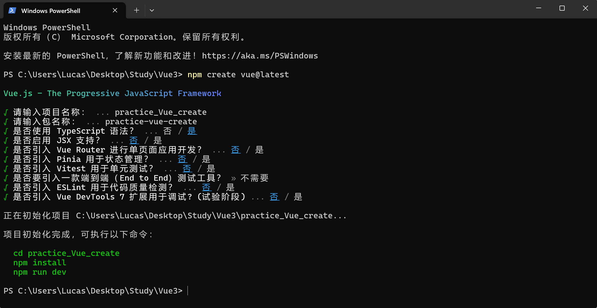

# Vue3学习笔记

## 第一天

### 基于vite创建Vue3项目


 项目虽然使用TypeScript，但是任然可以使用JavaScript

 Vue Router（路由）和ESLint等选项根据自身需求选择

 下载项目对应的module文件

 默认运行项目指令`npm run dev`或`yarn dev`(前提是安装yarn包)

### src文件夹介绍

 src文件夹默认包含`main.ts`,`App.vue`和`components`三部分，其中main.ts包括以下代码

```typescript
// 引入createApp用于创建应用
import {createApp} from "vue";
// 引入app组件
import App from "./App.vue";

createApp(App).mount("#app");
```

 `App.vue`是根组件，主要包括以下代码

```vue
<template>
    !-- html结构 -->
</template>

<script lang = "ts">
	// TS或JS
</script>

<style>
	// CSS样式，可写SASS和LESS
</style>
```

 `components`是存放枝组件的文件夹

### 实现一个简单的效果

```vue
// person.vue
<script lang="ts">
export default {
    name: 'Person',
    data(){
        return {
            name: "Person",
  			age: 18,
  			tel: '13812345678'
        }
    },
    methods: {
        changeName() {
            this.name = 'zhangsan'
        },
        changeAge() {
    		this.age++
		},
    	showTel() {
            alert(this.tel)
        }
    }
  
}
</script>

<template>
  <div class="person">
    <h2>姓名:{{ name }}</h2>
    <h2>年龄:{{ age }}</h2>
    <button @click="changeName">修改名字</button>
    <button @click="changeAge">修改姓名</button>
    <button @click="showTel">查看联系方式</button>
  </div>
</template>

<style scoped>
.person {
  background-color: skyblue;
  border-radius: 10px;
  padding: 10px;
  box-shadow: 0px 1px 4px rgba(0, 0, 0, 0.15);
}
</style>
```

 调用person组件

```vue
<script lang="ts">
import Person from "./components/person.vue" // 引入person.vue

export default {
  name: 'App', // 组件名
  components: {
    Person
  }
}
</script>

<template>
  <div class="app">你好啊！
    <Person></Person>
  </div>

</template>

<style scoped>
.app {
  background-color: #f5f5f5;
  box-shadow: 0px 1px 4px rgba(0, 0, 0, 0.15);
  border-radius: 20px;
  padding: 20px;
}
</style>
```

 呈现效果


### OptionsAPI与CompositionAPI

 Vue2是标准的选项式API，将数据（data），方法（methods），计算（computed），观察（watch）等分开写；优点在于，组件逻辑清晰，在组件功能较少时区分明显；缺点在于，当组件数据、功能较多时想新增过修改需求，需要分别修改data,methods,computed等，不便于维护和复用。可以说，写Vue2，就是学会写配置项。

 Vue3是组合式API，优点在于可以用函数的方式，更加优雅的组织代码，让相关功能的代码更加有序的组织在一起。也是Vue官方首推使用的方式。

### 拉开序幕的setup

 setup是Vue3新增的配置项，值是一个函数，组件中所有的数据、方法、计算属性等都配置在setup中

 其特点如下

- `setup`函数返回的对象中的内容可直接在模版中使用
- `setup`中访问的`this`是`undefined`，也就是不能在`setup`中使用this指代数据
- `setup`函数会在`beforeCreate`之前使用，它是“领先”所有钩子执行的

```vue
<script lang="ts">
export default {
  name: "Person",
  setup() {
    console.log(this) // setup中的this是undefined
    // 数据：原来是写在data中的
    // 这样写不是响应式数据
    let name = '张三'
    let age = 18;
    let tel = '13812345678'

    // 方法
    function changeName() {
      name = 'zhangsan' // 注意：这样修改name，页面是没有变化的
        				// name确实修改了，但页面上的name不会更改
        				// this.name这种写法是错误的
    }

    function changeAge() {
      age++
    }

    function showTel() {
      alert(tel)
    }

    return {name, age, tel, changeName, changeAge, showTel} // 可以使用键值对，如{a : name, 	b : age}；也可以直接写变量名和函数名
  },
}
</script>

<template>
  <div class="person">
    <h2>姓名:{{ name }}</h2>
    <h2>年龄:{{ age }}</h2>
    <button @click="changeName">修改名字</button>
    <button @click="changeAge">修改年龄</button>
    <button @click="showTel">查看联系方式</button>
  </div>
</template>

<style scoped>
.person {
  background-color: skyblue;
  border-radius: 10px;
  padding: 10px;
  box-shadow: 0px 1px 4px rgba(0, 0, 0, 0.15);
}

button {
  margin: 0 5px;
}
</style>

```

 此时，我们顺利使用Vue3重构本项目，但是你可以发现，名字和年龄并没有修改，而查看联系方式这个函数能正常执行

### `setup`与`optionAPI`

 在这个组件中，我同时使用了Vue2和Vue3的语法，由于`setup`的生命周期先于beforeCreate，此时setup中的数据成为了全局变量，所以在`data`中依然能访问到`setup`里面的数据。不过我们不推荐在一个项目中Vue2和Vue3的语法混写，这不利于项目的维护

```vue
<script lang="ts">
export default {
  name: "Person",
  data() {
    return {
      a: '测试'
    }
  },
  methods: {
    b() {
      console.log(this.a)
    }
  },
  setup() {
    console.log(this) // setup中的this是undefined
    // 数据：原来是写在data中的
    // 这样写不是响应式数据
    let name = '张三'
    let age = 18
    let tel = '13812345678'

    // 方法
    function changeName() {
      name = 'zhangsan' // 注意：这样修改name，页面是没有变化的
    }

    function changeAge() {
      age++
    }

    function showTel() {
      alert(tel)
    }

    return {name, age, tel, changeName, changeAge, showTel}
  },
}
</script>

<template>
  <div class="person">
    <h2>姓名:{{ name }}</h2>
    <h2>年龄:{{ age }}</h2>
    <button @click="changeName">修改名字</button>
    <button @click="changeAge">修改姓名</button>
    <button @click="showTel">查看联系方式</button>
    <hr>
    <h2>测试：{{ a }}</h2>
    <button @click="b">查看</button>
  </div>
</template>

<style scoped>
.person {
  background-color: skyblue;
  border-radius: 10px;
  padding: 10px;
  box-shadow: 0px 1px 4px rgba(0, 0, 0, 0.15);
}
</style>
```


## 第二天

### `setup`语法糖

 在之前的代码中，我们在`export default`里面单独写了`setup`配置项，其实我们可以把`setup`独立出去

 下面的代码中我单独写了两个script，一个专门用于写组件的名字，另一个专门用于写组合式API

 并且在单独的setup标签中，我们不需要写return返回值

```vue
// 这个标签的lang="ts"不能少
<script lang="ts">
export default {
  name: "Person",
}
</script>

<script lang="ts" setup>
// console.log(this) // setup中的this是undefined
// 数据：原来是写在data中的
// 这样写不是响应式数据
let name = '张三'
let age = 18
let tel = '13812345678'

// 方法
function changeName() {
  name = 'zhang_san' // 注意：这样修改name，页面是没有变化的
}

function changeAge() {
  age++
}

function showTel() {
  alert(tel)
}
</script>
```

### `ref`创建基本类型的响应式数据

 对基础数据类型要实现相应式，只需用`ref()`包裹数据

 注意：`JS`中操作数据需要`xxx.value`，但在模版中不需要`.value`

 对于`let name = '张三'`,`name`不是响应式的，`name.value`是

```vue
<script lang="ts" setup name="Person">
import {ref} from "vue";	// 引入ref
    
// 数据
let name = ref('张三')	// 此时name已经成为响应式数据
let age = ref(18)
let tel = '138111111111'

// 方法
function changeName() {	// 要访问到真正的name，需要使用name.value
    name.value = 'zhang_san'
}
    
function changeAge() {
    age.value ++
}
</script>
```

### `reactive`创建_对象类型的响应式数据

 `reactive`只能作用于对象，并且在`js`中操作数据不需要`.value`

```vue
<script lang="ts" setup name="Person">
import {reactive} from "vue";

// 数据
let car = reactive({brand: '奔驰', price: 100})	// 使用reactive包裹对象的数据，从而变成响应式数据
let games = reactive([	// 也可以包裹数组对象
  {id: 'wzry', name: '王者荣耀'},
  {id: 'ys', name: '原神'},
  {id: 'xqtd', name: '星穹铁道'}
])

let obj = reactive({
  a: {
    b: {
      c: 666
    }
  }
})

// 方法
const changePrice = () => {
  car.price += 10
}

const changeFirstName = () => {
  games[0].name = '绝区零'
}

const changeObj = () => {
  obj.a.b.c = 999
}
</script>
```

### `ref`创建_对象类型的响应式数据

```vue
 ref -> 可以定义：基本类型、对象类型的响应式数据

 reactive -> 只能定义：对象类型的响应式数据
```

 使用`ref`包裹对象本质上是他的`.value`变成`Proxy`,其实底层是用`reactive`实现的

```vue
<script lang="ts" setup name="Person">
import {ref} from "vue";

let car = ref({brand: '奔驰', price: 100})
let games = ref([
  {id: 'wzry', name: '王者荣耀'},
  {id: 'ys', name: '原神'},
  {id: 'xqtd', name: '星穹铁道'}
])

let obj = ref({
  a: {
    b: {
      c: 666
    }
  }
})

const changePrice = () => {
  car.value.price += 10	// 注意.value的位置，是操作car.value的数据
}

const changeFirstName = () => {
  games.value[0].name = '绝区零'
}

</script>
```

### `ref`对比`reactive`

 宏观角度

- 1.`ref`用来定义：基本数据类型，对象数据类型
- 2.`reactive`用来定义：对象类型数据

 区别

- 1.`ref`创建的变量必须使用`.value`（可以使用`volar`插件自动添加`.value`）
- 2.`reactive`重新分配一个新对象，会**失去**响应式（可以使用`Object.assign`去整体替换）

 使用原则

- 1.若需要一个基本类型的响应式数据，必须使用`ref`
- 2.若需要一个响应式对象，层级不变，`ref`,`reactive`都可以
- 3.若需要一个响应式对象，且层级较深，推荐使用`reactive`

```vue
<script lang="ts" setup name="Person">
import {ref, reactive} from "vue";

let car = ref({brand: '奔驰', price: 100})
let sum = ref(0)

const changePrice = () => {
  car.value.price += 10
}

const changeSum = () => {
  sum.value += 10
}

const changeBrand = () => {
  car.value.brand = '奥迪'
}

const changeCar = () => {
  // car = {brand: '宝马', price: 100}	// 这样的car就不再是响应式对象了
  // car = reactive({brand: '宝马', price: 200})	// reactive({brand: '宝马', price: 200})是新的对象了，不是原来的car对象
  // 下面这个写法页面可以更新
  // Object.assign(car, {brand: '宝马', price: 200})
  car.value = {brand: '宝马', price: 200}
}

</script>
```

### `toRef`和`toRefs`

 使用解构的时候，例如`let {name, age} = person`，此时`name`和`age`不是响应式数据，即使`let person = reactive({name: '张三', age: 18})`，这就相当于`let name = person.name`,修改的是`name`,而不是`person.name`,可以使用`toRefs`将对象变成多个`ref`定义的响应式对象

 注意使用`toRefs`定义的对象需要使用`.value`获取数据

 `let nl = toRef(person, 'age')`是解构单个对象变成响应式数据，`let 变量 = toRef(对象, 'key')`

```vue
<script lang="ts" setup name="Person">
import {reactive, toRefs, toRef} from 'vue';

let person = reactive({
  name: '张三',
  age: 18
})

let {name, age} = toRefs(person)
let nl = toRef(person, 'age')
console.log(nl.value)
// console.log(name)
// console.log(age)

function changeName(){
  name.value += '~'
}

function changeAge(){
  age.value += 1
}

</script>
```

## 第三天

### `computed`计算属性

在很多时候，我们需要使用已知的数据去获取新的数据，虽然可以直接在模版上面进行计算，但是这样不利于后期的维护，也会使模版变得更加臃肿，因此我们引入`computed`的概念，将所有需要计算的值统一放在里面

```vue
<template>
  <div class="person">
    姓: <input type="text" v-model="firstName"/>
    <br>
    名: <input type="text" v-model="lastName"/>
    <br>
    全名: <span>{{ fullName }}</span>
    <button @click="changeFullName">将全名改为li-si</button>
  </div>
</template>
```

这个案例的作用是分别输入姓和名，在最下方的全名标签会计算出名称


我们使用`fullName`变量去接收`computed`计算出来的数值

```vue
<script lang="ts" setup name="Person">
import {ref, computed} from 'vue';

let firstName = ref('张')
let lastName = ref('三')

// 这样定义fullName是一个计算属性，可读可写
let fullName = computed({
  // 计算后传递出去的值
  get() {
    return firstName.value.slice(0, 1).toUpperCase() + firstName.value.slice(1) + "-" + lastName.value
  },
  // val是计算出来的数值
  set(val) {
    const [str1, str2] = val.split('-')
    firstName.value = str1
    lastName.value = str2
  }
})
```

### `watch`监视

作用：监视数据的变化

特点：Vue3中的`watch`只能监视以下四种情况

- 1.`ref`定义的数据
- 2.`reactive`定义的数据
- 3.函数返回一个值
- 4.一个包含上述内容的数组

使用方法

- 1.引入`watch`,`import {watch} from 'vue'`
- 2.格式`watch(监视的基本类型数据, (newValue, oldValue), {deep、immediate、可选})

#### 监视`ref`定义的基本类型数据

`newValue` 是更新后的数据,`oldValue`是更新前的数据

```vue
<script lang="ts" setup name="Person">
import {ref, watch} from 'vue';

let sum = ref(0)

function changeSum() {
  sum.value++
}

// 监视
 watch(sum, (newValue, oldValue) => {
  console.log('sum变化了', newValue, oldValue)
  if(newValue >=10) {
    stopWatch()
  }
})

</script>

<template>
  <div class="person">
    <h1>监视ref定义的基本类型数据</h1>
    <h2>当前求和为：{{ sum }}</h2>
    <button @click="changeSum">点我加1</button>
  </div>
</template>
```

#### 监视`ref`定义的对象类型数据

```vue
<script lang="ts" setup name="Person">
import {ref, watch} from 'vue';

let person = ref({
  name: '张三',
  age: 18
})

function changeName() {
  person.value.name = 'zhang-san'
}

function changeAge() {
  person.value.age++
}

function changePerson() {
  person.value = {
    name: '李四',
    age: 100
  }
}

// 监视的是对象的地址值，若想监视对象内部属性的变化，需要手动深度监视
watch(person, (newValue, oldValue) => {
  console.log(newValue, oldValue)
}, {deep: true})

/*
watch的第一个参数是：被监视的数据
watch的第二个参数是：监视的回调
watch的第三个参数是：配置对象（deep, immediate等等……） 
*/

</script>

<template>
  <div class="person">
    <h1>监视ref定义的对象类型数据</h1>
    <h2>姓名:{{ person.name }}</h2>
    <h2>年龄:{{ person.age }}</h2>
    <button @click="changeName">修改名字</button>
    <button @click="changeAge">修改年龄</button>
    <button @click="changePerson">修改整个人</button>
  </div>
</template>
```

如果你细心可以发现，点击修改姓名和年龄按钮时，`newValue`和`oldValue`的值是一样的，但是点击修改整个人，`newValue`和`oldValue`又不一样。这是因为修改姓名和年龄的操作是只修改它的值，却并没有它的地址（你可以类比于C++的指针），而我们`newValue`和`oldValue`其实是监视它地址的变化；反之修改整个人，其实是单独开辟新的地址，并将这块地址命名为person，person的地址发生改变，因此`newValue`和`oldValue`不一样

#### 监视`reactive`定义的对象类型数据

监视`reactive`相比于`ref`最大的区别是`reactive`会自动完成深度监视，并且不能取消

```vue
<script lang="ts" setup name="Person">
import {reactive, watch} from 'vue';

let person = reactive({
  name: '张三',
  age: 18
})

function changeName() {
  person.name = 'zhang-san'
}

function changeAge() {
  person.age++
}

function changePerson() {
  // person = {
  //   name: '李四',
  //   age: 100
  // }
  Object.assign(person, {
    name: '李四',
    age: 100
  })
}

let obj = reactive({
  a: {
    b: {
      c: 100
    }
  }
})

function test() {
  obj.a.b.c = 888
}

// 监视reactive定义的对象类型数据，且默认开启深度监视
watch(person, (newValue, oldValue) => {
  console.log(newValue, oldValue)
})

watch(obj, (newValue, oldValue) => {
  console.log(newValue, oldValue)
})

/*
watch的第一个参数是：被监视的数据
watch的第二个参数是：监视的回调
watch的第三个参数是：配置对象（deep, immediate等等……）
*/

</script>

<template>
  <div class="person">
    <h1>监视ref定义的对象类型数据</h1>
    <h2>姓名:{{ person.name }}</h2>
    <h2>年龄:{{ person.age }}</h2>
    <button @click="changeName">修改名字</button>
    <button @click="changeAge">修改年龄</button>
    <button @click="changePerson">修改整个人</button>
    <hr>
    <h2>测试:{{ obj.a.b.c }}</h2>
    <button @click="test">点我修改</button>
  </div>
</template>

```

这个例子你又可以发现，点击修改整个人，`newValue`和`oldValue`却是一样，原因在于这行代码

`Object.assign(person, {name: '李四', age: 100})`

`assign`操作是将新的对象直接赋值给原来旧的对象，并没有单独开辟新的地址，因此`newValue`和`oldValue`一样

#### 监视`ref`或`reactive`定义的对象类型数据中的某个属性

- 1.若该属性值不是**对象类型**，需写成函数形式
- 2.若该属性值依然是**对象类型**，可以直接写，也可以写成函数，推荐写成函数

```vue
<script lang="ts" setup name="Person">
import {ref, reactive, watch} from 'vue';

let person = reactive({
  name: '张三',
  age: 18,
  car: {
    c1: '奔驰',
    c2: '宝马'
  }
})

function changeName() {
  person.name += '~'
}

function changeAge() {
  person.age += 1
}

function changeFirstCar() {
  person.car.c1 = '奥迪'
}

function changeSecondCar() {
  person.car.c2 = '大众'
}

function changeCar() {
  person.car = {
    c1: '雅迪',
    c2: '艾玛'
  }
}

// 监视响应式对象中的某个属性，且该属性是基本类型时，要写成函数
watch(() => person.name, (newValue, oldValue) => {
  console.log(newValue, oldValue)
},)

watch(() => person.car, (newValue, oldValue) => {
  console.log(newValue, oldValue)
}, {deep: true})

</script>

<template>
  <div class="person">
    <h2>姓名:{{ person.name }}</h2>
    <h2>年龄:{{ person.age }}</h2>
    <h2>汽车:{{ person.car.c1 }}、 {{ person.car.c2 }}</h2>
    <button @click="changeName">修改姓名</button>
    <button @click="changeAge">修改年龄</button>
    <button @click="changeFirstCar">修改第一台车</button>
    <button @click="changeSecondCar">修改第二台车</button>
    <button @click="changeCar">修改整个车</button>
  </div>
</template>
```

结论：监视的要是对象里面的属性，那么最好写函数式，注意点：若是对象监视的是地址值，需要关注对象内部，需要手动开启深度监视

#### 监视上述多个数据

```vue
<script lang="ts" setup name="Person">
import {ref, reactive, watch} from 'vue';

let person = reactive({
  name: '张三',
  age: 18,
  car: {
    c1: '奔驰',
    c2: '宝马'
  }
})

function changeName() {
  person.name += '~'
}

function changeAge() {
  person.age += 1
}

function changeFirstCar() {
  person.car.c1 = '奥迪'
}

function changeSecondCar() {
  person.car.c2 = '大众'
}

function changeCar() {
  person.car = {
    c1: '雅迪',
    c2: '艾玛'
  }
}

// 数组包函数
watch([() => person.name, () => person.car.c1], (newValue, oldValue) => {
  console.log(newValue, oldValue)
})

</script>

<template>
  <div class="person">
    <h2>姓名:{{ person.name }}</h2>
    <h2>年龄:{{ person.age }}</h2>
    <h2>汽车:{{ person.car.c1 }}、 {{ person.car.c2 }}</h2>
    <button @click="changeName">修改姓名</button>
    <button @click="changeAge">修改年龄</button>
    <button @click="changeFirstCar">修改第一台车</button>
    <button @click="changeSecondCar">修改第二台车</button>
    <button @click="changeCar">修改整个车</button>
  </div>
</template>
```

#### 总结

- **基本类型的 `ref`**：`newValue` 和 `oldValue` 在值变化时不同。
- **对象类型的 `ref`**：修改对象属性不会改变引用，`newValue` 和 `oldValue` 相同；重新赋值对象时不同。
- **`reactive`**：修改对象属性不会改变引用，`newValue` 和 `oldValue` 相同；重新赋值对象时不同。值得说明的一点是在`reactive`的情况下对象赋值只能通过`assign`的方式，因此`newValue` 和 `oldValue`一定相同

## 第四天

### `watchEffect`

在很多时候我们需要同时监视多个数据，因此可以使用`watch`配合数组进行监视

在下面的代码中，我们定义了`tmp`和`height`两个变量，有两个函数可以更新他的值，如果`tmp >= 60`或`height >= 80`时会返回字符串

```ts
// 数据
let tmp = ref(10)
let height = ref(0)

// 方法
function changeSum() {
  tmp.value += 10
}

function changeHeight() {
  height.value += 10
}

// watch实现
watch([tmp, height], (value) => {
  // console.log(value)
  let [newTmp, newHeight] = value // 从value中获取最新的水温水位
  if (newTmp >= 60 || newHeight >= 80) {
    console.log('给服务器发请求')
  } else console.log(newTmp, newHeight)
})
```

但是如果此时我们无需监视`height`，我们需要分别将与`height`有关的代码全部删除，这不利于维护，因此我们可以使用`watchEffect`代替`watch`

`watchEffect`会监控需要监控的全部数据，无需程序员手动维护监控

```ts
// 监视 --watchEffect实现
watchEffect(()=>{
  if(tmp.value >= 60 || height.value >= 80) {
    console.log('给服务发送请求')
  }
})
```

### 标签`ref`

如果此时有多个组件，我们需要获取某一个组件里面的`div`标签，以往我们会使用`class`或`id`获取，但是在Vue中，如果多个组件都存在id相同的标签那么会将他们一并获取，这不利于我们准确获取标签

例如我们要获取`h2`标签，只需为他添加`ref`

```html
<h2 ref="beijing">北京</h2>
```
并且设置变量接收

```ts
let beijing = ref()
```

使用`.value`就可以精确获取标签

```ts
console.log(beijing.value)
```

### TS中的接口、泛型、自定义类型

此时有一个对象`person`，里面包含一些数据,加入此时我的`name`写错了，或者`id`传入了`number`，编译器是不会有报错提示的（个别）

```ts
let person = {
    id: '12321',
    name: '张三',
    age: 60
  }
```

为了进一步规范和约束数据，我们在src文件夹中新建types文件夹，并且创建一个`index.ts`文件，专门用于编写接口文件

```ts
// 定义一个接口用于限制person对象的具体属性
export interface PersonInter {
    id: string,
    name: string,
    age: number
}
```

使用时需要先引入文件

```ts
import {type PersonInter} from '@/types'

let person : PersonInter = {
    id: '12321',
    name: '张三',
    age: 60
}

```

但是如果我们是数组包对象

```ts
// 第一种写法
let person : Array<PersonInter> =[
  {
    id: '12321',
    name: '张三',
    age: 60
  },
  {
    id: '12321',
    name: '张三',
    age: 60
  }
]

// 第二种写法
let person : PersonInter[] = [
  {
    id: '12321',
    name: '张三',
    age: 60
  },
  {
    id: '12321',
    name: '张三',
    age: 60
  }
]

// 第三种写法
let person = <PersonInter[]> [
  {
    id: '12321',
    name: '张三',
    age: 60
  },
  {
    id: '12321',
    name: '张三',
    age: 60
  }
]

// 第四种写法
let person = <Array<PersonInter>> [
  {
    id: '12321',
    name: '张三',
    age: 60
  },
  {
    id: '12321',
    name: '张三',
    age: 60
  }
]
```

当然我们也可以定义数组包对象的接口

```ts
// 第一种
export type PersonList = Array<PersonInter>
// 第二种
export type PersonList = PersonInter[]
```

使用方法

```ts
import {type PersonList} from '@/types'

let person = <PersonList> reactive([
  {
    id: '12321',
    name: '张三',
    age: 60
  },
  {
    id: '12321',
    name: '张三',
    age: 60
  }
])
```

### `props`的使用

很多时候我们需要进行组件间的数据沟通，比如父组件的数据给子组件

`a = "哈哈"`是将字符串传递给`Person`组件，`:list = "personList"`是将数组传递给子组件；注意，`:list`其实是`v-bind-list`的简写,主要用于传递表达式，而`list`是传递数据的名字

```vue
<script lang="ts" setup name=App>
import Person from "./components/Person.vue";
import {type PersonList} from "./types";
import {reactive} from "vue";

let personList = reactive<PersonList>([
  {
    id: '0',
    name: '张三',
    age: 18
  },
  {
    id: '1',
    name: '李四',
    age: 20
  }]
)

</script>

<template>
  <div class="app">
    <Person a="哈哈" :list = "personList"></Person>
  </div>

</template>
```

子组件接收

```ts
// 只接收
defineProps(['a', 'list'])
```

在模版中可以正常使用

```vue
<template>
  <div class="person">
    <ul>
      <li v-for="person in list" :key="person.id">
        姓名:{{ person.name }}
        年龄:{{ person.age }}
      </li>
    </ul>
  </div>
</template>
```

但是如果只看模版，你无法知道`list`是自定义的数据还是父组件传递的数据

```ts
// 接收a,同时将props保存起来
let x = defineProps(['a', 'list'])
```

我们也可以限制传入的数据类型，防止父组件失误将错误的数据传给我们

```ts
// 接收list+限制类型
defineProps<{ list: PersonList }>()
```

但是如果父组件传递错误数据，模版根本不会渲染，会导致相应部分空白，这也是不好的，因此我们可以自定义默认数据

注意：指定的`list`应为函数对象

```ts
// 接收list+限制类型+限制必要性+指定默认值
withDefaults(defineProps<{ list?: PersonList }>(), {
  list: () => [{
    id: '001',
    name: '康师傅',
    age: 100
  }]
})
```

